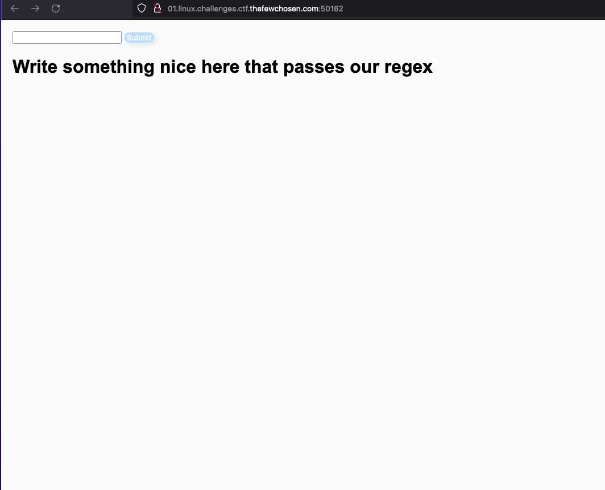
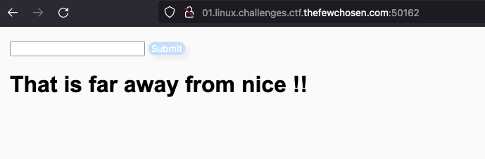
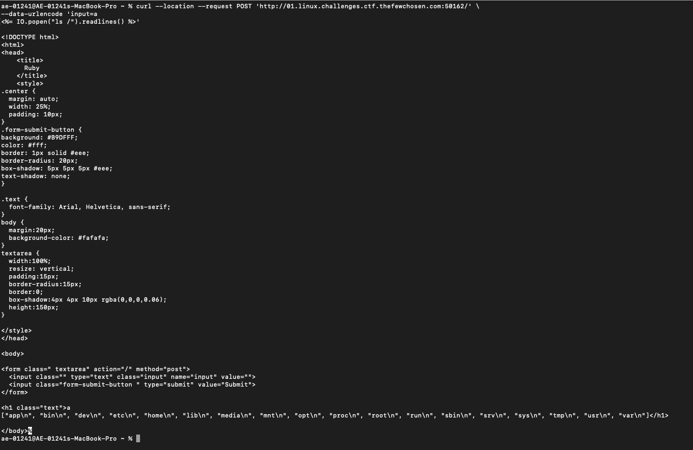
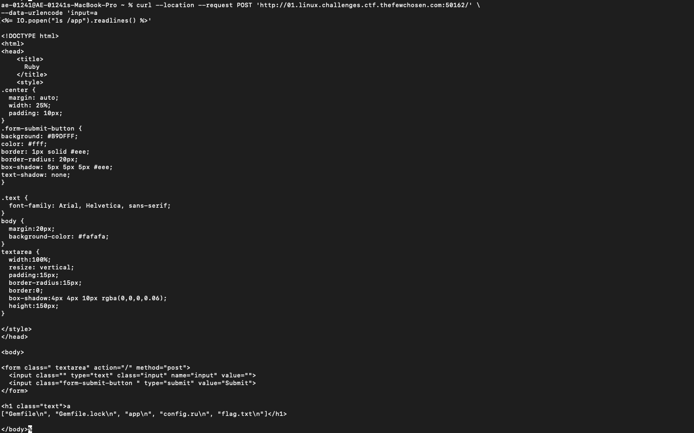
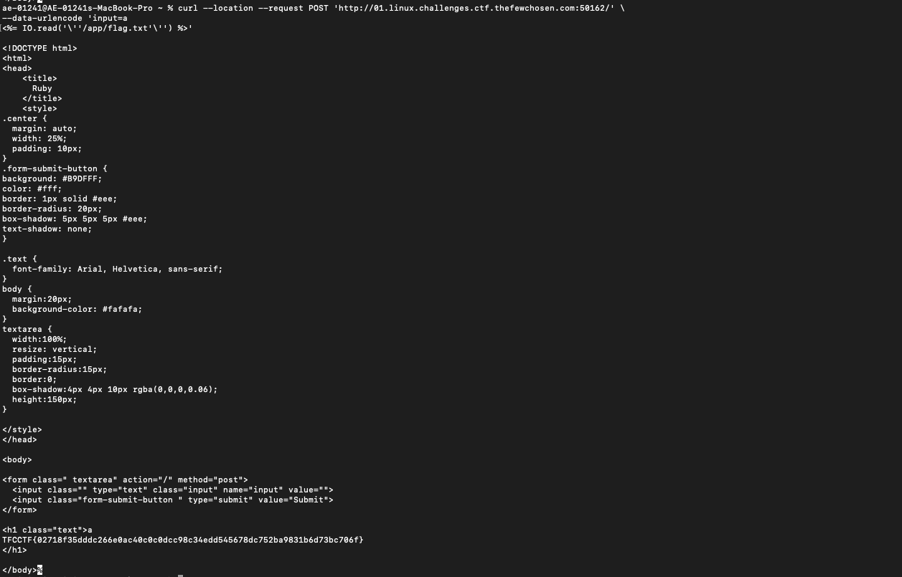

# Diamonds

### 385 points

## Information
    Author: skyv3il

    Write something nice that passes our filter.
 

## Steps done

1 - We acceded to the URL Title "Ruby" content 

2 - We sent a post with an "a" and the response was the same letter "a"
3 - We tried submitting something like `<b>a</b>` and the response was
 

The site only allowed A-Z,a-z,0-9
4 - We tried with a break line after the `a` and we sent `a
<%= IO.popen("ls /").readlines() %>` and we was able to did the directory listing

5 - We navigate through the directories

6 - And we read the flag file

TFCCTF{02718f35dddc266e0ac40c0c0dcc98c34edd545678dc752ba9831b6d73bc706f}
7 - We did not found the flag, we notice the string is on SHA-256 but we was not able to decrypte it.

- References:
    - https://github.com/attackercan/regexp-security-cheatsheet
    - https://github.com/swisskyrepo/PayloadsAllTheThings/blob/master/Server%20Side%20Template%20Injection/README.md#ruby---retrieve-etcpasswd

